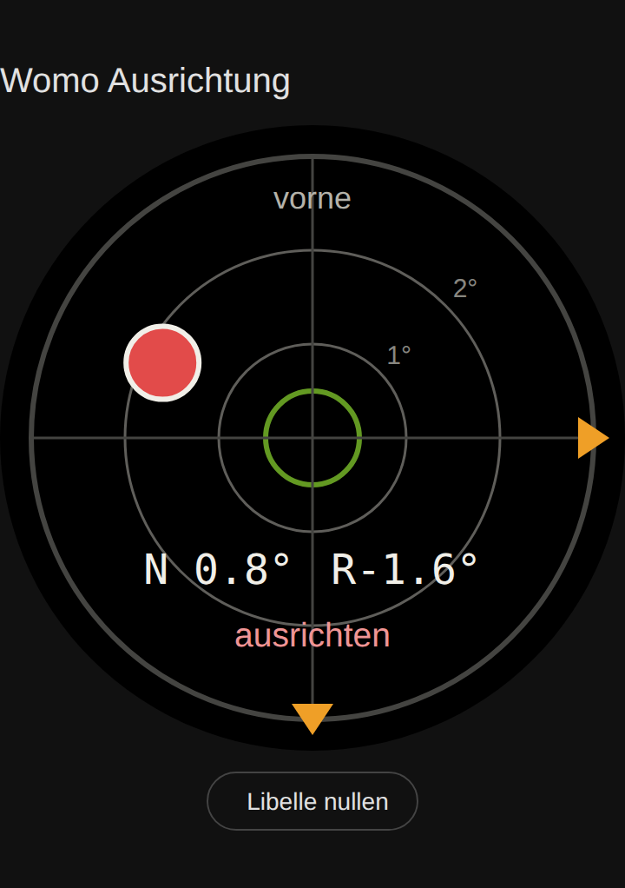

# WoMo Libelle Card

Eine Lovelace-Karte für Home Assistant, die eine Libelle (Wasserwaage) zum Ausrichten des Wohnmobils anzeigt.



- Blase wandert zur hohen Seite, Farbe grün / gelb / rot je nach Neigung
- Oranges Dreieck am Rand zeigt die Seite, die angehoben werden muss
- Nick- und Roll-Winkel mit fester Zeichenbreite (kein Zappeln der Zahlen)
- Optionaler Button „Libelle nullen“ mit Sicherheitsabfrage (zweimal tippen)
- Skaliert frei mit der Kartenbreite oder auf eine feste Maximalbreite
- Einstellbar per YAML oder im visuellen Karten-Editor

## Installation über HACS

1. HACS öffnen → Menü oben rechts (⋮) → **Benutzerdefinierte Repositories**
2. Repository-URL eintragen: `https://github.com/<DEIN-GITHUB-NAME>/womo-libelle-card`, Typ **Dashboard** (bei älteren HACS-Versionen „Lovelace“)
3. „WoMo Libelle Card“ suchen und **Herunterladen**
4. Browser neu laden (bei Bedarf Cache leeren)

HACS trägt die Ressource `/hacsfiles/womo-libelle-card/womo-libelle-card.js` automatisch ein.

## Manuelle Installation

1. `dist/womo-libelle-card.js` nach `/config/www/womo-libelle-card.js` kopieren
2. **Einstellungen → Dashboards → ⋮ → Ressourcen → Ressource hinzufügen**
   - URL: `/local/womo-libelle-card.js`
   - Typ: **JavaScript-Modul**
3. Browser neu laden

## Konfiguration

Die Karte ist im Karten-Picker unter „WoMo Libelle“ zu finden. Alternativ per YAML:

```yaml
type: custom:womo-libelle-card
title: Womo Ausrichtung
nick_entity: sensor.technik_esp_womo_libelle_nick
roll_entity: sensor.technik_esp_womo_libelle_roll
zero_entity: button.technik_esp_womo_libelle_libelle_nullen
```

| Option            | Typ     | Standard                               | Beschreibung |
|-------------------|---------|----------------------------------------|--------------|
| `nick_entity`     | Entität | `sensor.technik_esp_womo_libelle_nick` | Neigung vorne/hinten in Grad (vorne hoch = positiv) |
| `roll_entity`     | Entität | `sensor.technik_esp_womo_libelle_roll` | Neigung links/rechts in Grad (rechts hoch = positiv) |
| `zero_entity`     | Entität | –                                      | Button (oder Script) zum Nullen; ohne Angabe kein Button |
| `title`           | Text    | –                                      | Kartentitel |
| `threshold_level` | Zahl    | `0.5`                                  | Unter diesem Wert „waagerecht“ (grün) |
| `threshold_near`  | Zahl    | `1.5`                                  | Unter diesem Wert „fast gerade“ (gelb), darüber „ausrichten“ (rot) |
| `deg_per_ring`    | Zahl    | `1`                                    | Grad pro Skalenring – innerer Ring = 1×, äußerer = 2× |
| `size`            | Zahl    | `0`                                    | Maximale Breite der Libelle in px, `0` = volle Kartenbreite |
| `front_label`     | Text    | `vorne`                                | Beschriftung am oberen Rand |
| `show_values`     | bool    | `true`                                 | Winkelwerte anzeigen |
| `show_status`     | bool    | `true`                                 | Statuszeile anzeigen |

Ein Tipp auf die Libelle öffnet den Verlauf des Nick-Sensors.

### Beispiele

Grober Maßstab für unebenes Gelände (2° pro Ring):

```yaml
type: custom:womo-libelle-card
nick_entity: sensor.technik_esp_womo_libelle_nick
roll_entity: sensor.technik_esp_womo_libelle_roll
deg_per_ring: 2
threshold_near: 3
```

Kompakt für eine Seitenleiste:

```yaml
type: custom:womo-libelle-card
nick_entity: sensor.technik_esp_womo_libelle_nick
roll_entity: sensor.technik_esp_womo_libelle_roll
size: 200
show_status: false
```

## Lokale Vorschau

`demo/index.html` im Browser öffnen – die Regler simulieren die Sensoren, Home Assistant wird dafür nicht benötigt.

## Neue Version veröffentlichen

1. `CARD_VERSION` in `dist/womo-libelle-card.js` hochzählen
2. Auf GitHub ein Release mit passendem Tag anlegen (z. B. `v1.0.1`)
3. Der Workflow `release.yaml` hängt die JS-Datei automatisch an das Release, HACS bietet das Update dann an

## Lizenz

MIT
